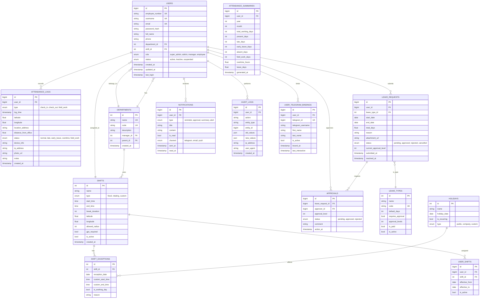

# 数据库 ER 图

## ER 图 (Mermaid)

## 表关系说明

| 关系 | 类型 | 说明 |
|------|------|------|
| users → departments | N:1 | 员工属于一个部门 |
| users → shifts | N:1 | 员工默认分配一个班次 |
| users → attendance_logs | 1:N | 员工有多条考勤记录 |
| users → leave_requests | 1:N | 员工可提交多条请假申请 |
| leave_requests → leave_types | N:1 | 请假申请属于一种请假类型 |
| leave_requests → approvals | 1:N | 请假申请需要多级审批 |
| shifts → shift_exceptions | 1:N | 班次有多个例外日期 |
| users → user_telegram_bindings | 1:N | 员工可绑定多个 Telegram 账号（历史记录） |
